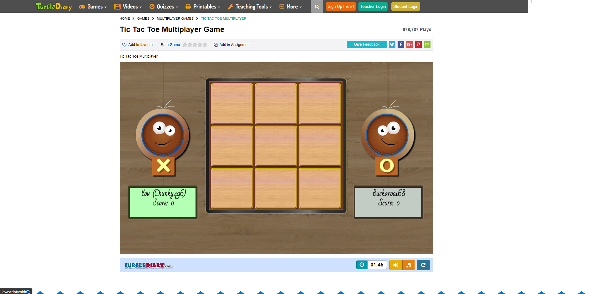
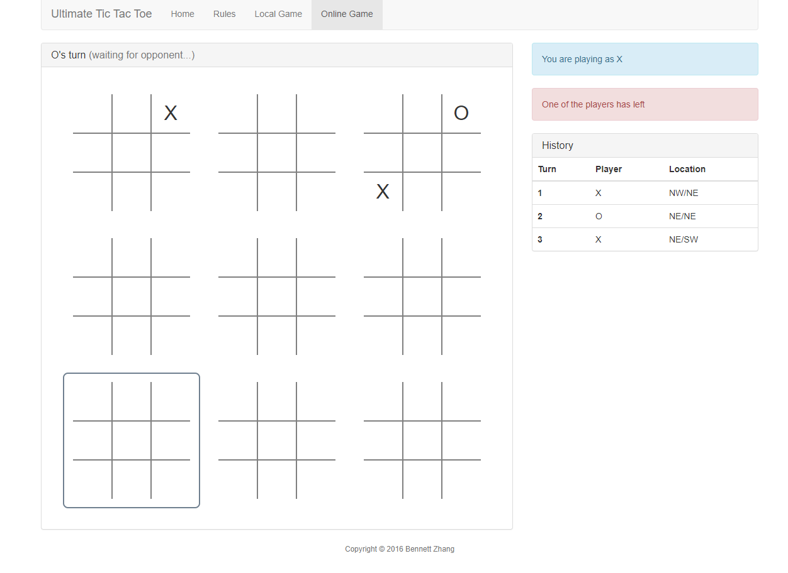
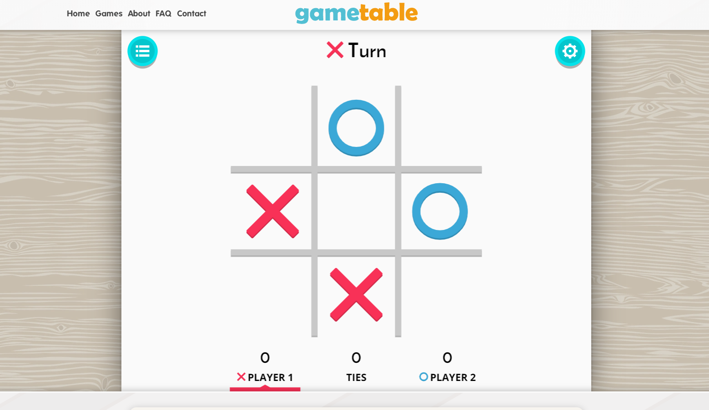
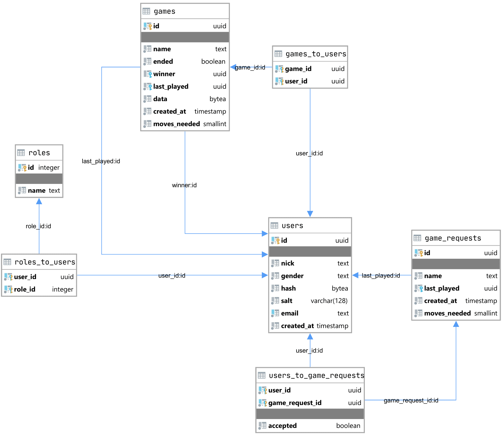

\setstretch{1.25}
\newpage
\hyphenpenalty=10000

\includepdf[pages=-]{MP.pdf}

\newpage

## Anotace {.unlisted .unnumbered}

Práce se zabývá rychle rostoucím a čím dál více populárním systémovým jazykem Rust.
Ukazuje, jak je tento systémový programovací jazyk vyspělý a
jaké má výhody oproti ostatním systémovým jazykům.

Tato práce konkrétně se zabývá programováním RESTful API serveru
v programovacím jazyku Rust pomocí frameworku Actix Web
a programováním front-endové webové aplikace pomocí frameworku Yew.
\

Klíčová slova: Rust, API, RESTful, Actix, Actix Web, Web, Server, Aplikace, Front-end,
Front-end aplikace, programování, framework, Yew

\newpage

## Annotation {.unlisted .unnumbered}

This work deals with the rapidly growing and increasingly popular
system programming language Rust. 
It shows how advanced this system programming language is
and what its advantages are over other system languages.

This work specifically deals with programming RESTful API server in Rust programming language
using the Actix Web framework and programming a front-end web application using
framework Yew.
\

Keywords: Rust, API, RESTful, Actix, Actix Web, Web, Server, Application, Front-end,
Front-end applications, programming, framework, Yew

\newpage
\tableofcontents
\newpage
\pagestyle{plain}

\parindent 1,25cm
\parskip 12pt

\newpage

# Úvod {.unnumbered}

Poslední dobou se všichni pokouší optimalizovat své web servery již při jejich programování,
kvůli náporu, který by nemusely stíhat.
Kdo tak neprovede může toho litovat a snaží se tento problém obejít jinak.
Tím že změní jazyk nebo vytvoří repliky své aplikace a dají na ně load-balancer,
tuto možnost nakonec musí využít všichni, při velmi vysokém náporu.

Bohužel nepoužívanější jazyky k naprogramování web serveru jsou PHP, JS (Node.js) nebo Python (Flask, Django).
Dá se v nich rychle udělat co potřebujete, ale mají spoustu nevýhod, a hlavně všechny tyto jazyky jsou tzv.\ interpretované jazyky.
To znamená, že na pozadí běží nějaký engine (interpreter), který musí zpracovat daný kód za běhu.
Jejich největším problémem oproti kompilovaným programovacím jazykům jako jsou Rust, C++, C#
je jejich rychlost a možnost zjisti chybu při kompilaci.

| Jazyk | Pomalejší než C++ (gcc -O2) |
|-:|:-|
Rust | 7 %
C# | 78 %
Node.js | 93 %
PHP | 596 %
Python 3.5 | 1800 %
Python 2.7 | 2562 %

: Porovnání rychlosti jazyků {#tbl:porovnani_rychlosti_jazyku}

Rozhodl jsem se ukázat, že systémový programovací jazyk Rust
je na tolik vyspělý, že se nejen zvládne vše, co jiné jazyky, ale i to, že je rychlejší
než konkurence.

Vybral jsem si programování RESTful API serveru a front-endové webové aplikace
z důvodu, že jsou to dne nejpoužívanější technologie a mají budoucnost.

Téma Piškvorky jsem si vybral z více důvodů.
Mělo by na něm jít perfektně předvést alespoň základy obou z frameworků.
Tato hra by měla být každému povědomá a nemusím se zabývat vysvětlováním pravidel.

\newpage

# Analýza obdobných aplikací

Analýzu obdobných aplikací je dobré provádět, abyste získali představu, jak má vaše aplikace vypadat.
Co chcete, aby uměla a v čem byla lepší něž ostatní aplikace.

## turtlediary

Adresa: <https://www.turtlediary.com/game/tic-tac-toe-multiplayer.html>

Web nabízí možnost hrát piškvorky 3x3 s náhodnými lidmi, nebo s kamarádem.

### Kladné stránky

- ke hraní není potřeba registrace
- vizuální rozhraní hry

### Záporné stránky

- web není responzivní
- hrací plocha je moc malá oproti zbylému volnému místu
- web nemá statistiky nebo výpis nejlepších hráčů
- na mobilním telefonu není hrací plocha vidět celá

{#fig:analýza1_turtlediary}

\newpage

## Ultimate Tic Tac Toe

Adresa: <https://ultimate-t3.herokuapp.com>

Web nabízí možnost hrát piškvorky 3x3 na více polích s kamarádem přes internet nebo lokálně.

### Kladné stránky

- ke hraní není potřeba registrace
- čistý interface

### Záporné stránky

- vice hracích ploch
- web nemá statistiky nebo výpis nejlepších hráčů

{#fig:analýza2_utimate_ttt}

\newpage

## gametable

Adresa: <https://gametable.org/games/tic-tac-toe>

Web nabízí možnost hrát piškvorky 3x3 s kamarádem lokálně nebo proti AI.

### Kladné stránky

- ke hraní není potřeba registrace
- čistý interface
- hra má vysvětleny pravidla pod hrací plochou

### Záporné stránky

- není možnost hrát s někým přes internet
- web nemá statistiky nebo výpis nejlepších hráčů

{#fig:analýza3_gametable}

\newpage

# Návrh projektu

## Obecná struktura

Veškeré požadavky, které nebudou odkazovat na front-end zodpovídá API.
API je poté napojené na databázi a redis.

Front-end nemá sám o sobě žádný přístup k databázi nebo redisu.

## API

API spojuje vše dohromady. Poskytuje veškeré informace front-endu
a zpracovává veškeré příchozí informace.

## Redis

V redisu jsou ukládány uživatelské relace, aby k nim byl rychlý přístup a jejich ověření.

## Databáze

Databáze ukládá informace o uživatelích a hrách pro dlouhodobé uložení dat.

Diagram [@fig:er_diagram]

## Front-end

Slouží jako grafické zobrazení dat a druhořadá kontrola dat.
Zobrazuje informace o uživatelích a hrách.

\newpage

# Zpracování praktické části

## Back-end

### Správa uživatelů

Uživatelé jsou umístěni v tabulce *users*.
Role jsou uloženy v tabulce *roles* a jsou k uživatelům přiřazovány skrz tabulku *roles_to_users*.

Pokud má uživatel roli *Admin* tak mohou upravovat kohokoli údaje bez omezení včetně rolí a hesla.

Pokud má uživatel roli *Banned* tak nemůže vytvářet pozvánky,
ani nemůže být zahrnut do pozvánky jiným uživatelem.

### Vytváření žádostí o hru

Přihlášení uživatelé mají možnost vytvářet nové hry s různými parametry.

Nejprve se vytvoří žádost o hru, která se nachází v tabulce *game_requests*.
K dané žádosti na hru se přiřadí uživatelé skrz tabulku *users_to_game_requests*.

Pozvánky nemohou vytvářet uživatelé s rolí *Banned*.

### Vytvoření hratelné hry

Po vytvoření žádosti o hru jí musí všichni hráči potvrdit a hra bude vytvořena,
nebo někdo z pozvaných hráčů odmítne žádost a žádost o hru bude vymazána.

Jakmile je účast všech hráčů potvrzena, tak se vytvoří nová hra v tabulce *games*,
přiřadí se k ní uživatelé skrz tabulku *games_to_users* a žádost o hru je poté vymazána.

### Hraní hry

Hrát můžete jen když jste na tahu a pokud hrané políčko ještě nebylo použito.
Vyhraní hry se kontroluje na front-endu, pokud front-end usoudí,
že hráč vyhrál tak výhru oznámí back-endu a ten výhru zkontroluje.

Back-end kontroluje, jestli je hráč na tahu, jestli hra neskončila, nebo jestli jeho tah je validní.
V případě, že hráč ohlásí výhru, ale server zjistí, že lže, tak daný tah zahodí a odpoví chybou.

## Front-end

### Registrace

Všechna pole jsou kontrolována. 
Pokud nějaké pole není validní, tak se nepošlou data na back-end.

Back-end data zkontroluje a pokud zjistí, že nejsou validní,
tak žádost zahodí a vrátí chybu.

Pro hashování hesla se používá 128 znaková sůl a algoritmus Argon2.

### Profil

Zobrazuje informace o uživateli a hry,
ve kterých se nachází.

Zobrazuje také počet výher, proher a remíz. 
Z těchto dat poté vypočítá winrate (výhry / prohry).

Pokud je uživatel na svém profilu, nebo pokud má uživatel roli *Admin*,
tak se mu také zobrazí tlačítko na upravení profilu.

### Výpis uživatelů

Zobrazuje všechny registrované uživatele a pár informací o nich.

Uživatelům s rolí *Admin* se navíc zobrazuje tlačítko upravení profilu.

### Výpis her

Zobrazuje všechny rozehrané, nebo dohrané hry s jejich hráči.

### Hraní hry

Hry jsou hrány na síti 30x30.

Uživatelé jsou zobrazováni s jejich symbolem a za jménem je napsáno, jestli jsou na tahu.

Hrát můžou jen uživatelé, kteří jsou v dané hře, ale dívat se může kdokoli.

Tahy uživatelů jsou kontrolovány, jestli jsou validní a jestli nastala výhra nebo remíza.

### Výpis pozvánek

Zobrazuje název pozvánky (později název hry), počet tahů k vítězství.

Uživatel může pozvánku přijmout, nebo odmítnout.

### Vytváření pozvánky

Při vytváření pozvánky jsou skoro všechna pole kontrolována.

Uživatelé s rolí *Admin* mají práva na vypnutí skoro všech kontrol.

### Úprava uživatele

Uživatel může upravovat vše, kromě jeho rolí.

Uživatel s rolí *Admin* může upravovat vše a má možnost vypnout kontrolu,
která je vyžadována po ostatních uživatelích.

\newpage

# Závěr

\newpage

# Seznam použité literatury a zdrojů informací

\newpage

# Seznam použitých zkratek

| Zkratka | Význam |
|-:|:---------|
API | Application Programming Interface
REST | Representational State Transfer
SPŠE | Střední průmyslová škola elektrotechnická
VOŠ | Vysoká odborná škola

: Seznam použitých zkratek {#tbl:seznam_použitých_zkratek}

\newpage

# Seznam obrázků, tabulek, příloh

\listoffigures
\listoftables
\listoflistings

\newpage

# Přílohy

{#fig:er_diagram}
