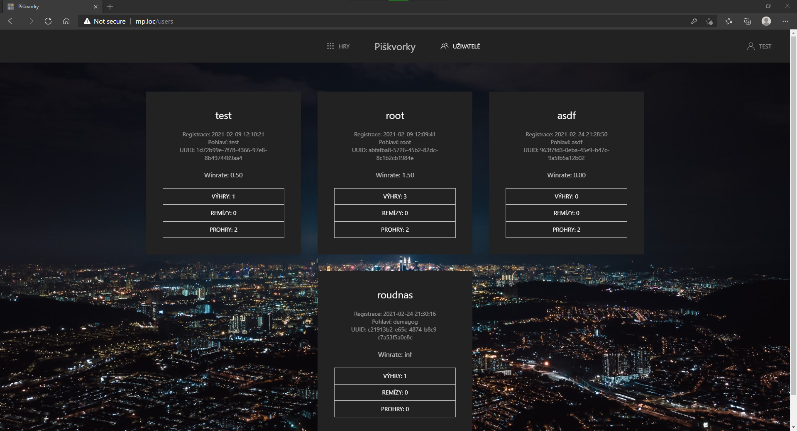
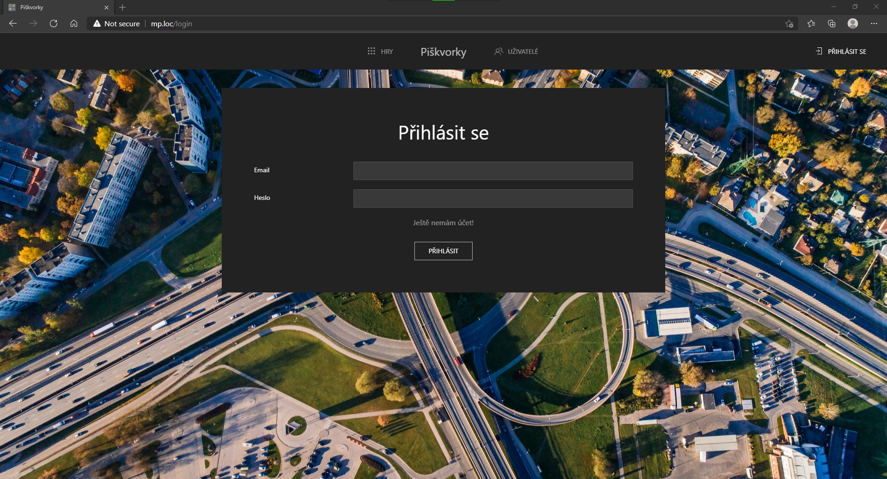
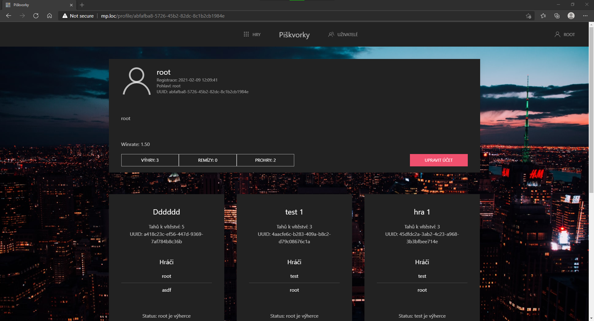
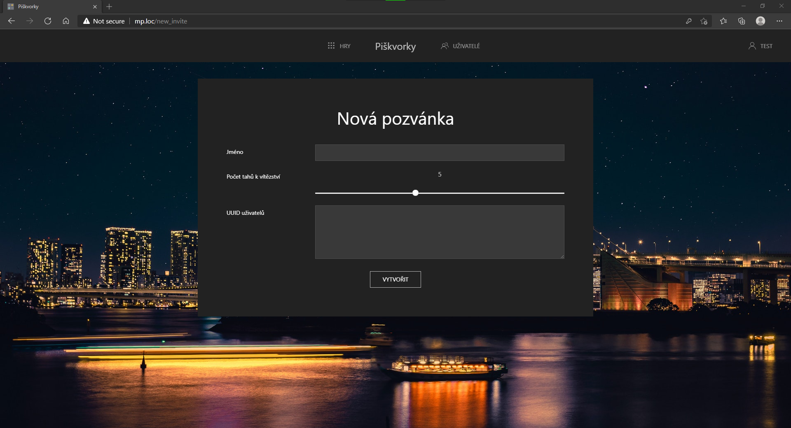
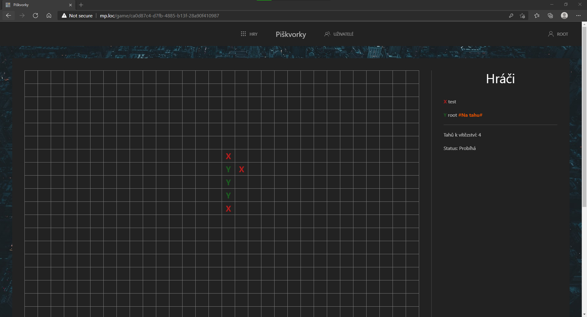

<style>
img[alt~="center"] {
  display: block;
  margin: 0 auto;
}
</style>


<!--
_class: lead invert
_footer: ""
_header: ""
_paginate: false
-->

# ⭕️ Piškvorky ❌

Jan Najman 4.D

---

## Osnova 🧾

- O projektu
- Použité technologie
- Vývojové prostředí
- Zabezpečení
- Ukázka
- Problémy


---

## Piškvorky

- Vznikly za doby prastarého Egypta (1300 BC)
- Nejoblíbenější znaky jsou ❌ a ⭕️
- Většinou hrají 2 hráči

<!--
Postavit platformu pro další rozvoj.
Ukázat výkonnost Rustu.
Použít moderní koncept microservices.
-->

---

## Použité technologie 🚀

   

---

## Vývojové prostředí

  

---

## Zabezpečení


---

## Základ

```rust
pub enum UserStatus {
    LoggedIn(uuid::Uuid),
    NotLoggedIn,
}

impl FromRequest for UserStatus {
    ...
}
```

---

## FromRequest

```rust
let session = Session::from_request(req, payload);
...
match session.get::<uuid::Uuid>("id") {
    Ok(Some(id)) => {
        session.renew();
        Ok(UserStatus::LoggedIn(id))
    }
    Ok(None) => Ok(UserStatus::NotLoggedIn),
    Err(_) => Err(error::ErrorInternalServerError(""))
}
```

---

## Přihlášený uživatel s rolemi

```rust
pub struct UserWithRoles {
    pub id: uuid::Uuid,
    pub roles: Vec<Role>,
}

impl UserWithRoles {
    pub fn is_admin(&self) -> bool {
        self.roles.contains(&Role::Admin)
    }
    pub fn is_banned(&self) -> bool {
        self.roles.contains(&Role::Banned)
    }
}
```

---

## FromRequest admin

```rust
let user_fut = UserWithRoles::from_request(req, payload);
Box::pin(async move {
    let user = user_fut.await?;
    if user.is_admin() {
        Ok(AdminUser {
            id: user.id,
            roles: user.roles,
        })
    } else {
        Err(error::ErrorUnauthorized("Admin role needed"))
    }
})
```

---

```rust
pub enum UserStatus {
    LoggedIn(uuid::Uuid),
    NotLoggedIn,
}
pub struct AdminUser {
    pub id: uuid::Uuid,
    pub roles: Vec<Role>,
}
pub struct UserWithRoles {
    pub id: uuid::Uuid,
    pub roles: Vec<Role>,
}
pub struct UserWithoutBan {
    pub id: uuid::Uuid,
    pub roles: Vec<Role>,
}
pub struct LoggedInUser(pub uuid::Uuid);
pub struct NotLoggedInUser;
```

---

## Ukázka použití

```rust
pub async fn admin_new(
    _: AdminUser, pool: Data<PgPool>, data: Json<NewGameData>,
) -> impl Responder {
    match data.users_id.len() {
        2..=5 => 
            process(data.into_inner(), pool.get_ref(), false).await,
        x if x < 2 => 
            resp_400_BadReq!("At least 2 users are needed"),
        x if x > 5 => 
    resp_400_BadReq!("Make more symbols and I will raise the limit"),
        _ => unreachable!("Impossible number..."),
    }
}
```

---

<!--
_footer: ""
_header: ""
-->


---

<!--
_footer: ""
_header: ""
-->



---

<!--
_footer: ""
_header: ""
-->


---

<!--
_footer: ""
_header: ""
-->



---

<!--
_footer: ""
_header: ""
-->



---


<!--
_footer: ""
_header: ""
-->



---


<!--
_footer: ""
_header: ""
-->


---

<!--
_footer: ""
_header: ""
-->



---

# Problémy


---


---

# Prostor pro otázky


---

<!-- _class: lead invert -->

# Zdroje

[Virus Tic Tac Toe](https://media.kasperskydaily.com/wp-content/uploads/sites/86/2014/10/05200054/Play-tic-tac-toe-with-virus-1.png)
[Rust logo](https://upload.wikimedia.org/wikipedia/commons/thumb/d/d5/Rust_programming_language_black_logo.svg/1200px-Rust_programming_language_black_logo.svg.png)
[PostgreSQL logo](https://upload.wikimedia.org/wikipedia/commons/2/29/Postgresql_elephant.svg)
[Redis logo](https://cdn.iconscout.com/icon/free/png-256/redis-4-1175103.png)
[Docker logo](https://www.docker.com/sites/default/files/social/docker_facebook_share.png)

---

<!-- _class: lead invert -->

[Obrázek otazníku](https://pngimg.com/uploads/question_mark/question_mark_PNG56.png)
[Rust maskot](https://rustacean.net/assets/rustacean-flat-happy.png)
[Obrázek zámku](https://assets-global.website-files.com/5db35de024bb983af1b4e151/5eb274abca48d15ef5598b93_og-image-security.png)
[MySQL logo](https://i.iinfo.cz/images/571/mysql-1.png)
[CORS obrázek](https://miro.medium.com/max/1130/1*LT6mOsVuAMppnvH8LkBYiA.png)
[Neovim logo](https://upload.wikimedia.org/wikipedia/commons/thumb/0/07/Neovim-mark-flat.svg/1200px-Neovim-mark-flat.svg.png)
[Rust analyzer logo](https://raw.githubusercontent.com/rust-analyzer/rust-analyzer/master/assets/logo-wide.svg)

